# Jarkom-Modul-4-IT16-2024
 
## Anggota Kelompok
| NRP        | Nama                    |
|:----------:|:-----------------------:|
| 5027221020 | Wikri Cahya Syahrila    |
| 5027221021 | Steven Figo             |

## RUTE
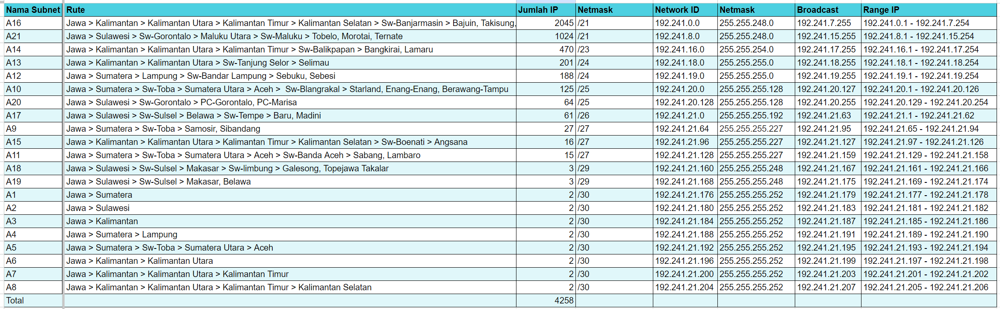

## Topologi GNS VLSM
### PEMBAGIAN IP VLSM
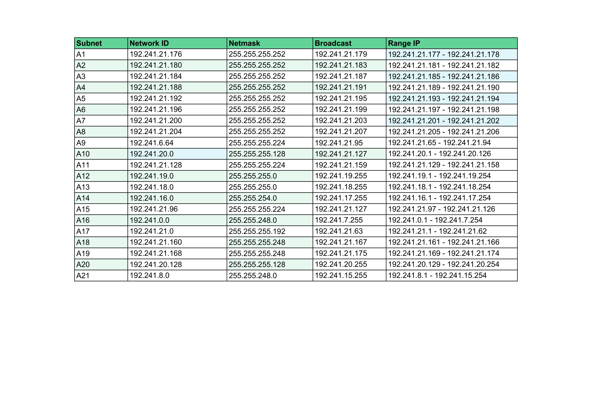

### TREE VLSM
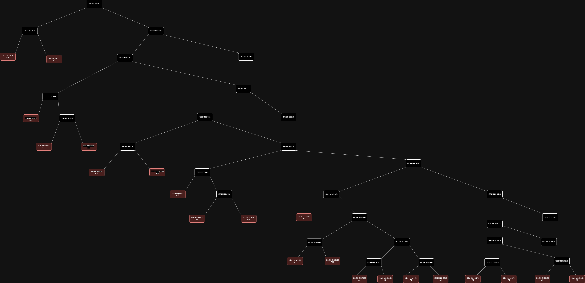

## Topologi CPT CIDR
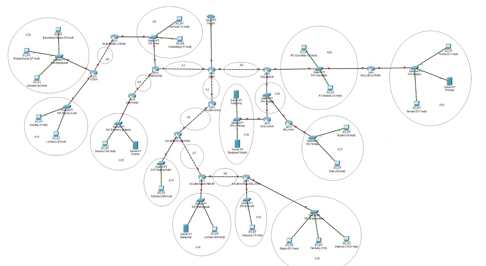

### Pembagian 1
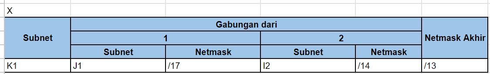
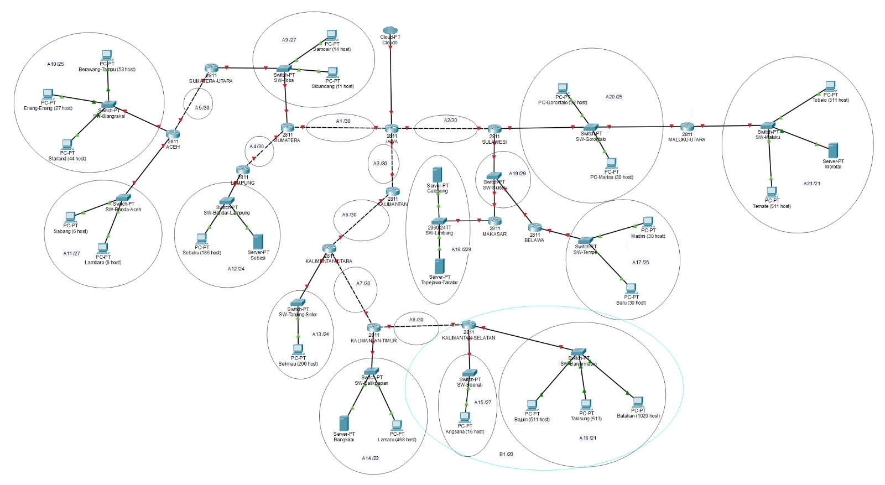

### Pembagian 2
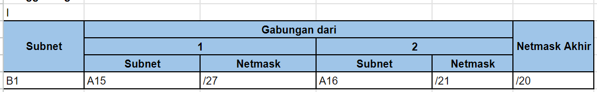

### Pembagian 3
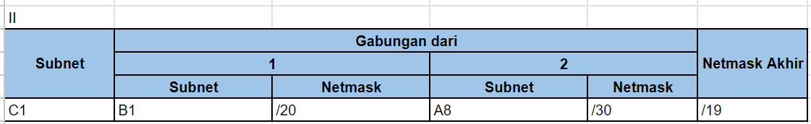

### Pembagian 4
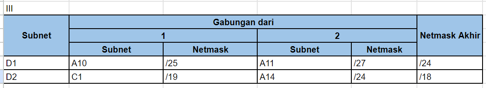
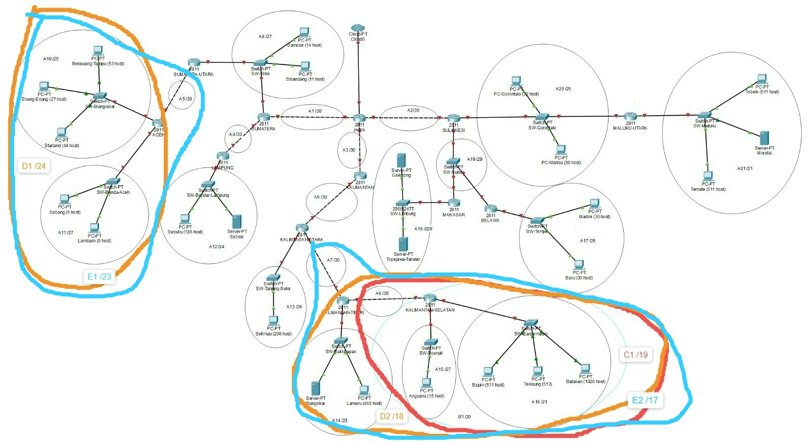

### Pembagian 5
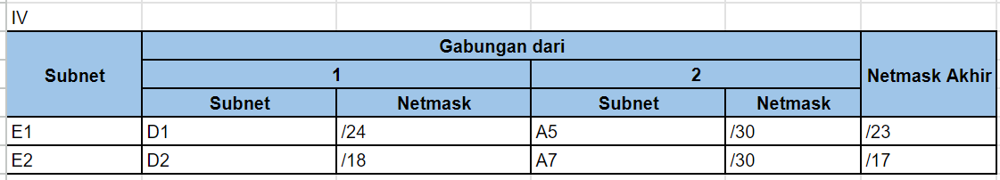
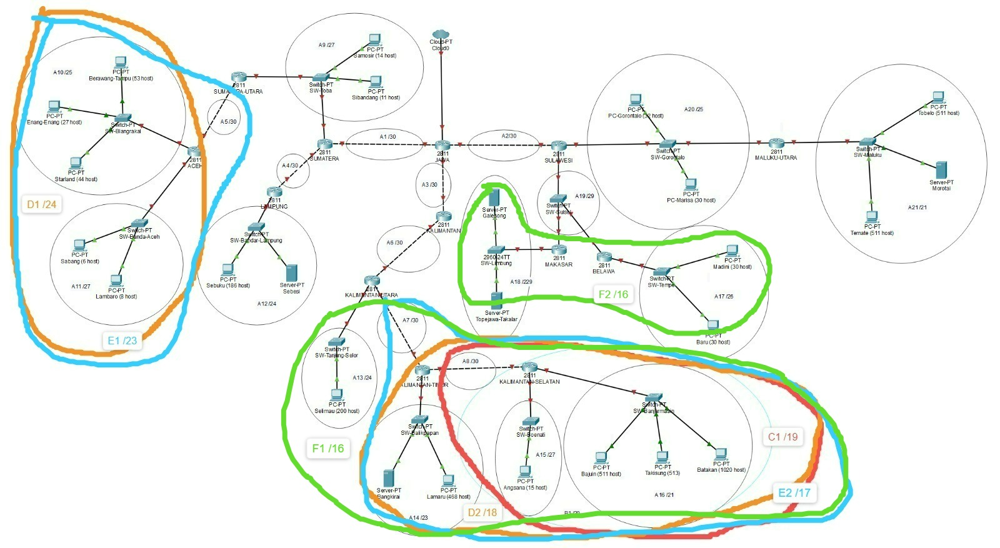

### Pembagian 6
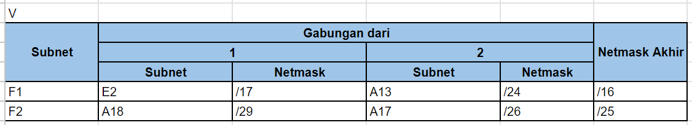

### Pembagian 7
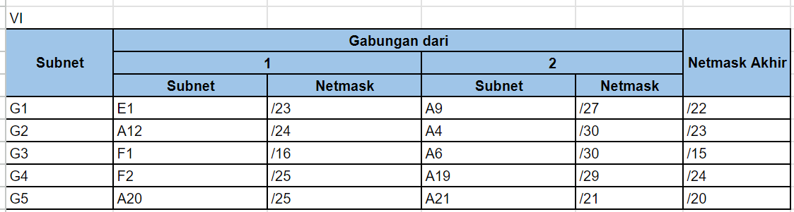
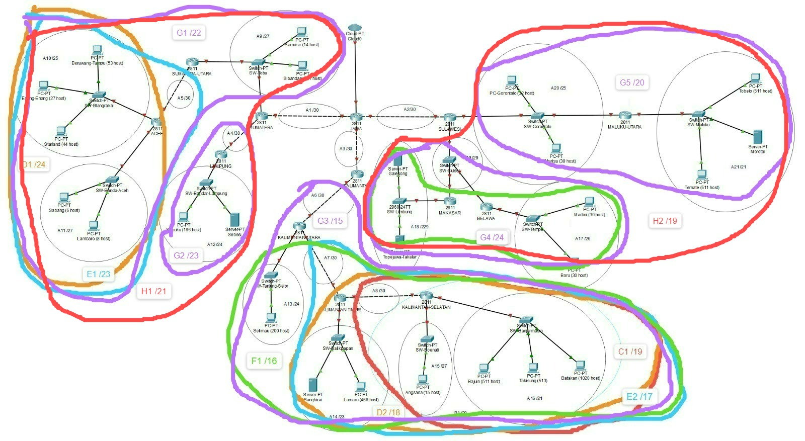

### Pembagian 8
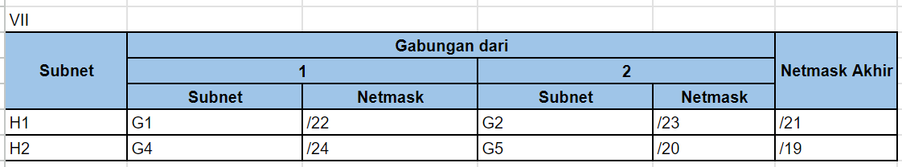
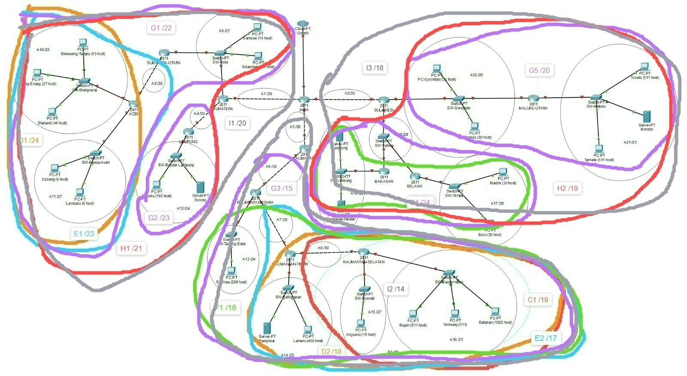

### Pembagian 9

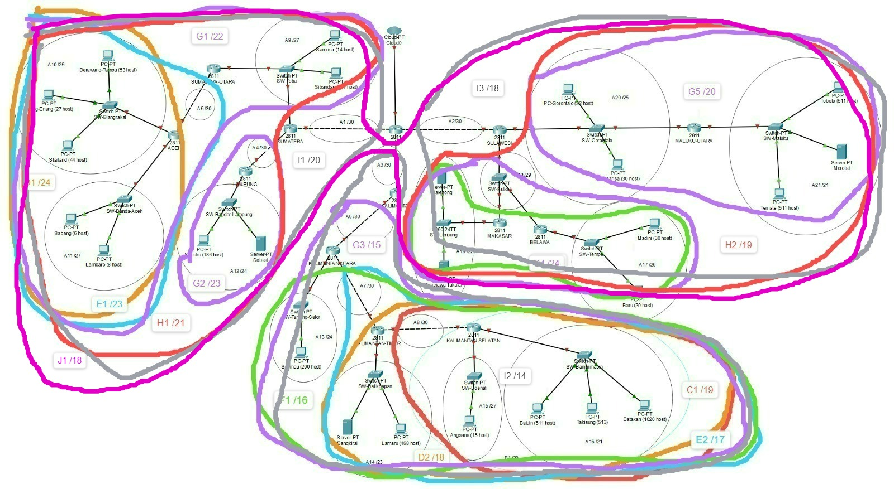

### Pembagian 10
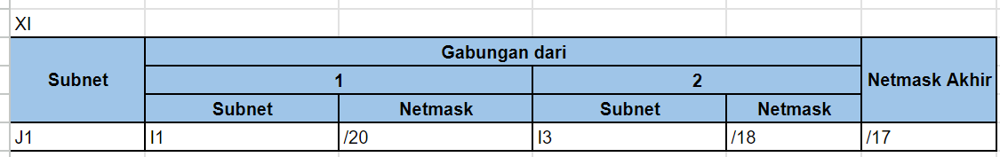
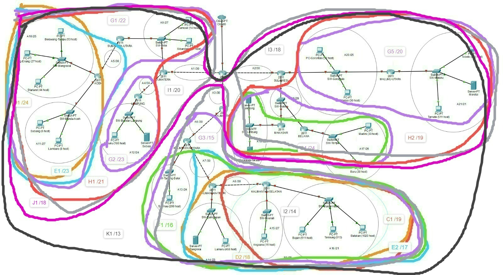

## Tree
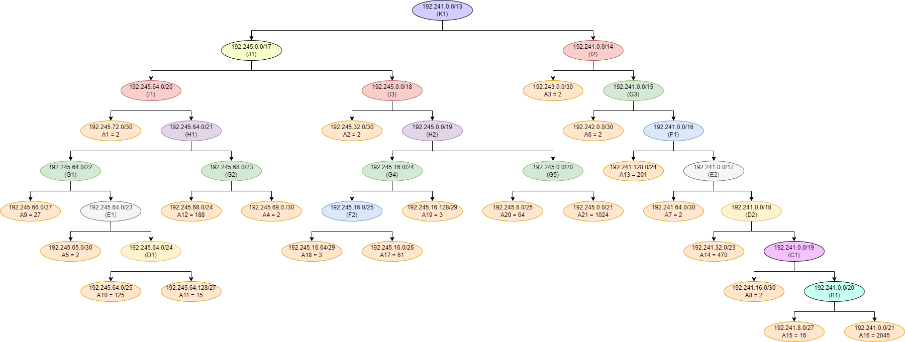

## Pembagian IP
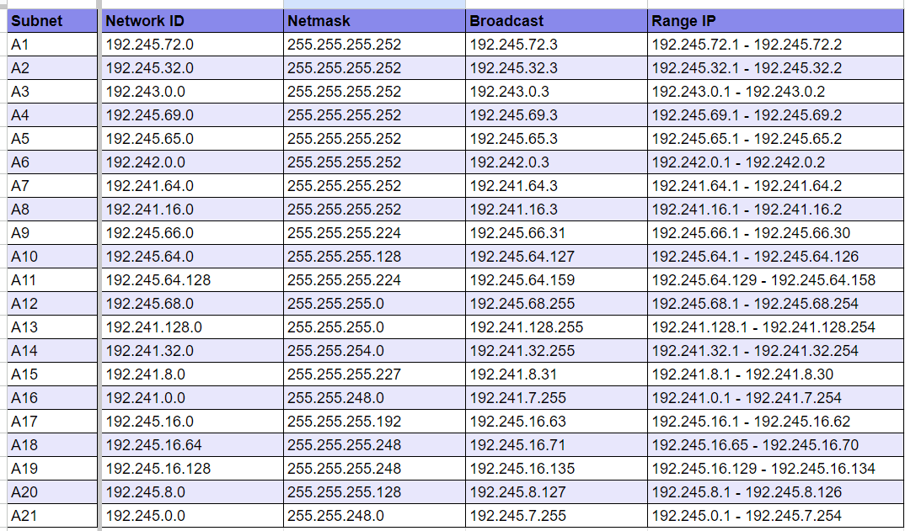

## Testing
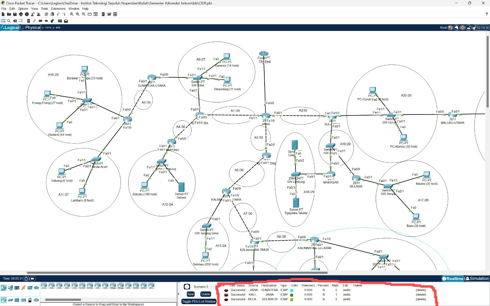
