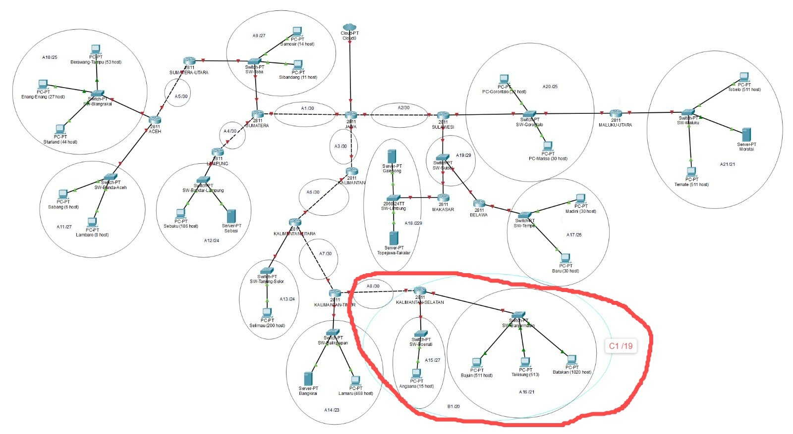
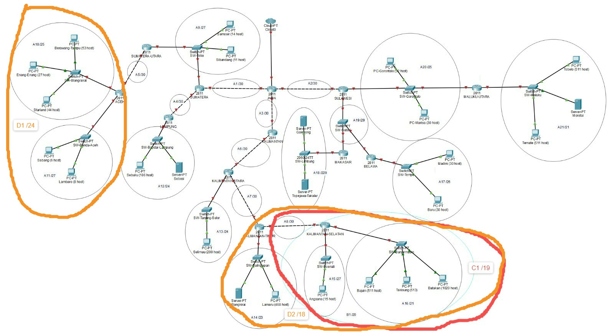
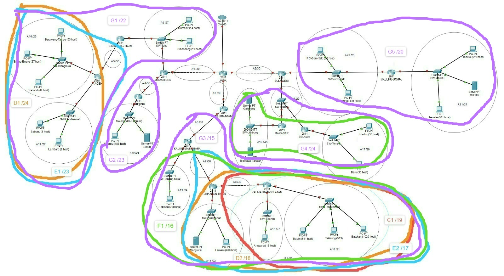
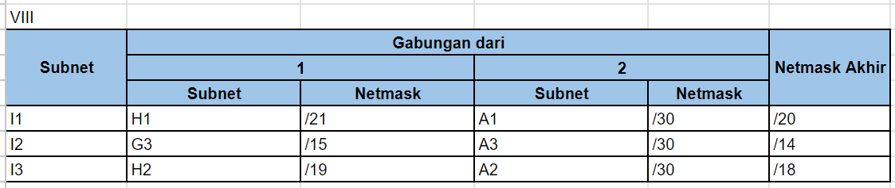

# Jarkom-Modul-4-IT16-2024
 
## Anggota Kelompok
| NRP        | Nama                    |
|:----------:|:-----------------------:|
| 5027221020 | Wikri Cahya Syahrila    |
| 5027221021 | Steven Figo             |

## RUTE

## Topologi GNS VLSM
### PEMBAGIAN IP VLSM

### TREE VLSM

## Topologi CPT CIDR

### Pembagian 1

### Pembagian 2

### Pembagian 3

### Pembagian 4

### Pembagian 5

### Pembagian 6

### Pembagian 7

### Pembagian 8

### Pembagian 9

### Pembagian 10

## Tree

## Pembagian IP

## Testing

